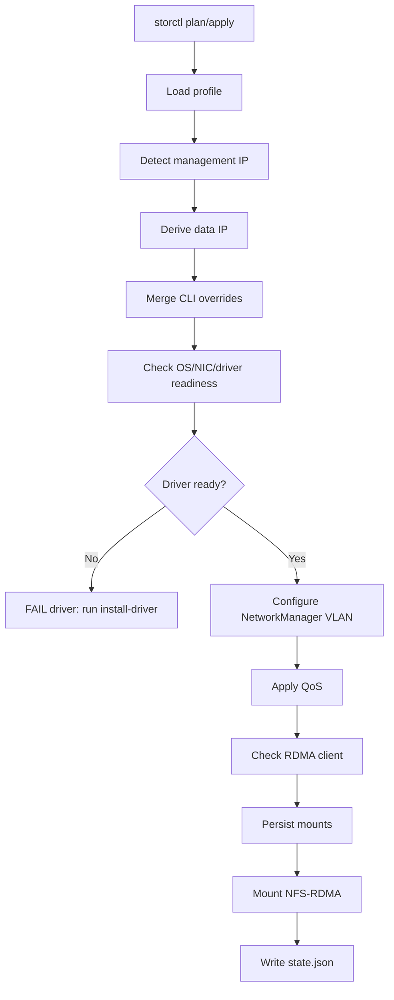

# storctl

[中文文档](README.md)

`storctl` joins a lab host to NFS-RDMA storage.

It configures a storage NIC, NetworkManager VLAN, routing rule, CX7/1823 QoS,
NFS-RDMA mounts, mount persistence, and a small state file for later checks. It
is designed to be copied to one host and run directly, or called by Ansible for
batch onboarding.

The default assumption is an offline or weakly connected lab. `apply` only
checks whether the driver is ready; it does not install drivers or fetch
packages. Pre-distribute artifacts with Ansible/scp, then run
`storctl install-driver` explicitly.

## Quick Start

Explicit single-host mode:

```bash
storctl apply \
  --nic enp194s0f1np1 \
  --nic-type auto \
  --vlan-id 172 \
  --data-ip 172.27.2.146/18 \
  --gateway 172.27.0.1 \
  --route-table 5000 \
  --artifact-dir /root/storage_pkgs \
  --mount 172.27.1.1:/Share:/mnt/share \
  --mount 172.27.1.1:/Weight:/mnt/weight
```

Profile-driven mode:

```bash
storctl plan --profile c4 --nic enp23s0f1 --mgmt-ip 80.5.17.113
storctl apply --profile c4 --nic enp23s0f1 --mgmt-ip 80.5.17.113
```

Check the current host:

```bash
storctl check
```

Install a local driver artifact:

```bash
storctl install-driver --nic-type cx7 --artifact-dir /root/storage_pkgs
storctl install-driver --nic-type 1823 --artifact-dir /root/storage_pkgs
```

## Workflow



`plan` stops after rendering the final configuration. It never changes the
host. `apply` runs the full workflow.

## Profiles

Profiles reduce per-host arguments. `storctl` looks for profiles in this order:

1. `--profile-file /path/to/storctl-profiles.json`
2. `./storctl-profiles.json`
3. `/etc/storctl/profiles.json`

Example:

```json
{
  "profiles": {
    "c4": {
      "vlan_id": 172,
      "gateway": "172.27.0.1",
      "prefix": 18,
      "route_table": 5000,
      "mtu": 5500,
      "artifact_dir": "/root/storage_pkgs",
      "third_octet_map": {
        "17": 4
      },
      "mounts": [
        {"server": "172.27.1.1", "export": "/Share", "mount_point": "/mnt/share"},
        {"server": "172.27.1.1", "export": "/Weight", "mount_point": "/mnt/weight"}
      ]
    }
  }
}
```

Data IP derivation uses the management IP:

```text
mgmt-ip 80.5.17.113
third_octet_map["17"] = 4
prefix = 18
result = 172.27.4.113/18
```

CLI arguments always win over profile values. For example, `--data-ip` skips
data IP derivation, and repeated `--mount` flags replace profile mounts.

## Batch Usage

Recommended Ansible shape:

```bash
ansible all -m copy -a "src=storctl-linux-arm64 dest=/usr/local/bin/storctl mode=0755"
ansible all -m copy -a "src=storage_pkgs/ dest=/root/storage_pkgs/"
ansible all -m copy -a "src=storctl-profiles.json dest=/etc/storctl/profiles.json"
ansible all -m shell -a "storctl install-driver --nic-type {{ nic_type }} --artifact-dir /root/storage_pkgs"
ansible all -m shell -a "storctl plan --profile c4 --nic {{ storage_nic }} --mgmt-ip {{ ansible_host }}"
ansible all -m shell -a "storctl apply --profile c4 --nic {{ storage_nic }} --mgmt-ip {{ ansible_host }}"
```

For mixed clusters, create one profile per cluster and pass the profile name
from inventory:

```bash
ansible all -m shell -a "storctl apply --profile {{ storage_profile }} --nic {{ storage_nic }} --mgmt-ip {{ ansible_host }}"
```

## Build

```bash
go test ./...
go build ./cmd/storctl
GOOS=linux GOARCH=arm64 go build -o storctl-linux-arm64 ./cmd/storctl
```

## Offline Driver Artifacts

Artifacts are read from `--artifact-dir`. `storctl apply` does not install
drivers and does not access the public internet. Driver installation must be
explicit through `storctl install-driver`.

The directory must include a manifest:

```text
/root/storage_pkgs/
  storctl-artifacts.json
  MLNX_OFED_LINUX-5.8-1.1.2.1-openeuler22.03-aarch64.tgz
  nic_1823-openeuler22.03-aarch64.tar.gz
```

Example `storctl-artifacts.json`:

```json
{
  "artifacts": [
    {
      "os_id": "openEuler",
      "os_version_prefix": "22.03",
      "arch": "aarch64",
      "nic_type": "cx7",
      "file": "MLNX_OFED_LINUX-5.8-1.1.2.1-openeuler22.03-aarch64.tgz",
      "sha256": "replace-with-sha256",
      "requires_repo": false
    },
    {
      "os_id": "openEuler",
      "os_version_prefix": "22.03",
      "arch": "aarch64",
      "nic_type": "1823",
      "file": "nic_1823-openeuler22.03-aarch64.tar.gz",
      "sha256": "replace-with-sha256",
      "requires_repo": false
    }
  ]
}
```

This repository also includes [storctl-artifacts.example.json](storctl-artifacts.example.json) as a template.

Generate checksums:

```bash
sha256sum /root/storage_pkgs/*.tgz /root/storage_pkgs/*.tar.gz
```

- CX7 prefers true offline `MLNX_OFED_LINUX-*.tgz` or `IB_NIC-*.tgz` bundles.
- 1823 supports `nic_1823.tar.gz` or `hinic*.tar.gz`.
- Firmware upgrade is disabled unless `--upgrade-firmware` is set.
- `doca-host*.rpm` is a repo installer. It is allowed only when the manifest
  sets `"requires_repo": true` and the command includes `--allow-repo`:

```bash
storctl install-driver --nic-type cx7 --artifact-dir /root/storage_pkgs --allow-repo
```

Keep the OS/driver matrix in the team wiki. Humans read the wiki; `storctl`
checks the manifest:

| OS | Arch | CX7 artifact | 1823 artifact | Notes |
| --- | --- | --- | --- | --- |
| openEuler 22.03 | aarch64 | `MLNX_OFED_LINUX-*.tgz` | `nic_1823*.tar.gz` | Main path |
| openEuler 23.x | aarch64 | To verify | To verify | Add an explicit manifest row |
| openEuler 24.03 | aarch64 | Matching DOCA/MLNX package | To verify | Prefer true offline bundles |

If DOCA Host is required, prepare an internal dnf repo first. `storctl` does
not maintain cross-lab repositories.

## TCP Fallback

```bash
storctl apply ... --allow-tcp-fallback
```

The default target is NFS-RDMA. If RDMA is unavailable, `apply` fails and keeps
completed configuration; it does not silently switch to TCP.

With `--allow-tcp-fallback`, `storctl` mounts TCP NFS, persists TCP options, and
writes `degraded: true` to `/var/lib/storctl/state.json`. `storctl check` then
prints `WARN degraded tcp-fallback`. This mode is for temporary service
continuity, not performance sign-off.

## Troubleshooting

`rdma link` is empty:

- The host has no available RDMA device, so NFS-RDMA cannot work yet.
- Check drivers and modules:
  ```bash
  rdma link
  lsmod | grep -iE 'rdma|roce|ib_|uverbs|xprtrdma|hinic|mlx5'
  modprobe xprtrdma
  ```

Mount is TCP instead of RDMA:

- By default, `storctl` remounts target paths when it finds `proto=tcp`.
- If temporary degradation is acceptable, pass `--allow-tcp-fallback`.
- Verify:
  ```bash
  findmnt --mountpoint /mnt/share -o TARGET,FSTYPE,SOURCE,OPTIONS
  nfsstat -m
  ```

systemd automount fails:

- `storctl` falls back to direct `mount -t nfs`.
- Inspect unit logs:
  ```bash
  systemctl status mnt-share.automount --no-pager
  journalctl -u mnt-share.automount -xe
  ```

1823 ECN sysfs is missing:

- Some 1823 driver versions do not expose `/sys/class/net/<nic>/ecn/cc_algo`.
- `storctl` treats that as optional and still applies `hinicadm3 qos`.

## Notes

- `storctl` does not implement DTFS, `cid`, `dn`, or zone generation.
- State is written to `/var/lib/storctl/state.json`.
- With systemd, mounts use `.mount/.automount` units. Without systemd, mounts
  are persisted in `/etc/fstab`.
