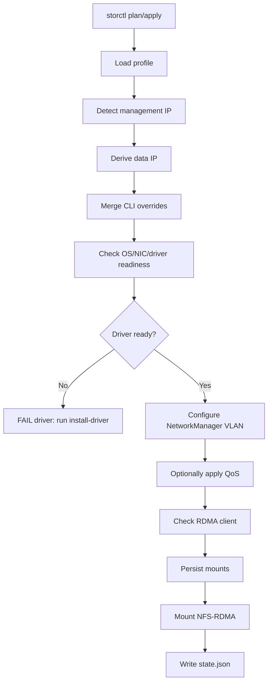

# storctl

[中文文档](README.md)

`storctl` joins a lab host to NFS-RDMA storage.

It configures a storage NIC, NetworkManager VLAN, routing rule, CX7/1823 QoS,
NFS-RDMA mounts, mount persistence, and a small state file for later checks. It
is designed to be copied to one host and run directly, or called by Ansible for
batch onboarding.

The default assumption is an offline or weakly connected lab. `apply` only
checks whether the driver is ready; it does not install drivers or fetch
packages. Pre-distribute artifacts with Ansible/scp, then run
`storctl install-driver` explicitly.

## Design Principles

`storctl` follows the Unix style: do one host-local storage onboarding job well,
with clear output, reliable exit codes, and behavior that composes with other
tools.

It is responsible for:

- Resolving the final host configuration from a profile.
- Checking local OS, NIC type, driver, RDMA, QoS, and mount state.
- Idempotently configuring NetworkManager VLANs, routing rules, explicitly
  enabled QoS, and NFS mount persistence.
- Selecting a local driver artifact that matches the host OS, architecture, and
  NIC type.
- Printing step-level `OK / SKIP / WARN / FAIL` output.

It is not responsible for:

- SSHing to multiple machines.
- Distributing the binary, profiles, or driver artifacts.
- Maintaining cross-lab yum/dnf repositories.
- Managing Ansible inventory.
- Guessing which one of several 200G ports is the correct storage port.

Batch orchestration belongs in Ansible or similar systems. `storctl` is the
single-host command they call.

For scripts, use JSON output. Human `OK / SKIP / WARN / FAIL` text is for
troubleshooting; JSON is the stable machine interface.

## Command Safety

| Command | Mutates host | Needs root |
| --- | --- | --- |
| `plan` | no | no |
| `check` | no | no |
| `facts` | no | no |
| `version` | no | no |
| `generate-manifest` | no | no |
| `validate-profile` | no | no |
| `validate-artifacts` | no | no |
| `install-driver` | yes | yes |
| `apply` | yes | yes |

## NIC Selection

`--nic` must be an explicit physical interface name, such as `enp23s0f1` or
`enp194s0f1np1`. `storctl` intentionally does not support `--nic auto`.

Many hosts have two 200G ports. Choosing the wrong storage port is more costly
than passing one inventory variable.

Useful commands for choosing the NIC:

```bash
ip -br link
ibdev2netdev
hinicadm3 info
ethtool <nic> | grep -i speed
```

Recommended Ansible inventory shape:

```ini
node-39-149 ansible_host=80.5.17.113 storage_nic=enp23s0f1 nic_type=1823 storage_profile=c4
node-25-146 ansible_host=80.5.25.146 storage_nic=enp194s0f1np1 nic_type=cx7 storage_profile=c25
```

`--nic-type auto` is still useful. It only detects whether the already selected
`--nic` is `cx7` or `1823`; it never selects the NIC for you.

When a profile run uses `--mgmt-ip`, `apply` checks whether `--nic` already
owns that management IP before touching NetworkManager. If it does, the command
fails early so the SSH management interface is not reconfigured as a storage
VLAN interface.

## Quick Start

For a detailed single-host walkthrough, see [docs/tutorial.md](docs/tutorial.md).

Explicit single-host mode:

```bash
storctl apply \
  --nic enp194s0f1np1 \
  --nic-type auto \
  --vlan-id 172 \
  --data-ip 172.27.2.146/18 \
  --gateway 172.27.0.1 \
  --route-table 5000 \
  --artifact-dir /root/storage_pkgs \
  --mount 172.27.1.1:/Share:/mnt/share \
  --mount 172.27.1.1:/Weight:/mnt/weight
```

Profile-driven mode:

```bash
storctl plan --profile c4 --nic enp23s0f1 --mgmt-ip 80.5.17.113
storctl apply --profile c4 --nic enp23s0f1 --mgmt-ip 80.5.17.113
```

Check the current host:

```bash
storctl check
storctl check --json
storctl facts --json
storctl version --json
```

Install a local driver artifact:

```bash
storctl install-driver --nic-type cx7 --artifact-dir /root/storage_pkgs
storctl install-driver --nic-type 1823 --artifact-dir /root/storage_pkgs
```

## Workflow



`plan` stops after rendering the final configuration. It never changes the
host. `apply` runs the full workflow.

## Profiles

Profiles reduce per-host arguments. `storctl` looks for profiles in this order:

1. `--profile-file /path/to/storctl-profiles.json`
2. `./storctl-profiles.json`
3. `/etc/storctl/profiles.json`

Example:

```json
{
  "profiles": {
    "c4": {
      "vlan_id": 172,
      "gateway": "172.27.0.1",
      "prefix": 18,
      "route_table": 5000,
      "mtu": 5500,
      "artifact_dir": "/root/storage_pkgs",
      "third_octet_map": {
        "17": 4
      },
      "mounts": [
        {"server": "172.27.1.1", "export": "/Share", "mount_point": "/mnt/share"},
        {"server": "172.27.1.1", "export": "/Weight", "mount_point": "/mnt/weight"}
      ]
    }
  }
}
```

Data IP derivation uses the management IP:

```text
mgmt-ip 80.5.17.113
third_octet_map["17"] = 4
prefix = 18
result = 172.27.4.113/18
```

CLI arguments always win over profile values. For example, `--data-ip` skips
data IP derivation, and repeated `--mount` flags replace profile mounts.

QoS is disabled by default. Enable it only after switch and storage policy are
confirmed:

```bash
storctl apply ... --qos apply
```

Profiles can enable QoS and override the built-in parameters:

```json
{
  "profiles": {
    "c4": {
      "qos": {
        "enabled": true,
        "cx7": {
          "pfc": "0,0,0,0,1,0,0,0",
          "tos": 128,
          "prio_tc": "1,0,0,0,4,0,0,0",
          "tsa": "ets,ets,ets,ets,ets,ets,ets,ets",
          "tcbw": "10,0,0,0,90,0,0,0"
        },
        "nic_1823": {
          "ecn_algo": "dcqcn",
          "pfc": "0,0,0,0,1,0,0,0",
          "trust": "dscp",
          "ets_classes": "0,1,2,3,4,5,6,7",
          "ets_weights": "10,0,0,0,90,0,0,0"
        }
      }
    }
  }
}
```

CLI wins: `--qos off` overrides profile `qos.enabled=true`.

## Batch Usage

Recommended Ansible shape. Inventory carries per-host differences; profiles
carry cluster-level defaults:

```bash
ansible all -m copy -a "src=storctl-linux-arm64 dest=/usr/local/bin/storctl mode=0755"
ansible all -m copy -a "src=storage_pkgs/ dest=/root/storage_pkgs/"
ansible all -m copy -a "src=storctl-profiles.json dest=/etc/storctl/profiles.json"
ansible all -m shell -a "storctl install-driver --nic-type {{ nic_type }} --artifact-dir /root/storage_pkgs"
ansible all -m shell -a "storctl plan --profile {{ storage_profile }} --nic {{ storage_nic }} --mgmt-ip {{ ansible_host }}"
ansible all -m shell -a "storctl apply --profile {{ storage_profile }} --nic {{ storage_nic }} --mgmt-ip {{ ansible_host }}"
```

Collect status with stable JSON:

```bash
ansible all -m shell -a "storctl check --json"
ansible all -m shell -a "storctl facts --json"
```

Each check has stable fields:

```json
{
  "checks": [
    {"name": "rdma", "status": "warn", "code": "rdma_link_empty", "message": "rdma link empty"}
  ],
  "summary": {"ok": 0, "warn": 1, "fail": 0}
}
```

`facts --json` only collects host facts. It does not judge whether onboarding
succeeded, and is useful for batch inventory of OS, command availability,
interfaces, RDMA links, and systemd.

Minimum inventory variables:

```yaml
storage_nic: enp23s0f1
nic_type: 1823
storage_profile: c4
ansible_host: 80.5.17.113
```

Keep `vlan_id`, `gateway`, `route_table`, `mounts`, and data-IP derivation rules
in the profile. Keep `storage_nic` in inventory. That boundary keeps failures
easy to reason about.

## Build

```bash
go test ./...
go build ./cmd/storctl
GOOS=linux GOARCH=arm64 go build -o storctl-linux-arm64 ./cmd/storctl
```

## Offline Driver Artifacts

Artifacts are read from `--artifact-dir`. `storctl apply` does not install
drivers and does not access the public internet. Driver installation must be
explicit through `storctl install-driver`.

The directory must include a manifest:

```text
/root/storage_pkgs/
  storctl-artifacts.json
  MLNX_OFED_LINUX-5.8-1.1.2.1-openeuler22.03SP4-aarch64.tgz
  SDK_LINUX-17.12.5.0-openEuler22.03SP4-aarch64.tar.gz
```

Example `storctl-artifacts.json`:

```json
{
  "artifacts": [
    {
      "os_id": "openEuler",
      "os_version_prefix": "22.03-LTS-SP4",
      "arch": "aarch64",
      "nic_type": "cx7",
      "file": "MLNX_OFED_LINUX-5.8-1.1.2.1-openeuler22.03SP4-aarch64.tgz",
      "sha256": "replace-with-sha256",
      "requires_repo": false
    },
    {
      "os_id": "openEuler",
      "os_version_prefix": "22.03-LTS-SP4",
      "arch": "aarch64",
      "nic_type": "1823",
      "file": "SDK_LINUX-17.12.5.0-openEuler22.03SP4-aarch64.tar.gz",
      "sha256": "replace-with-sha256",
      "requires_repo": false
    }
  ]
}
```

This repository also includes [storctl-artifacts.example.json](storctl-artifacts.example.json) as a template.

Generate a manifest from a local directory. This prints JSON to stdout and does
not modify files:

```bash
storctl generate-manifest \
  --artifact-dir /root/storage_pkgs \
  --os-id openEuler \
  --os-version-prefix 22.03-LTS-SP4 \
  --arch aarch64 > /root/storage_pkgs/storctl-artifacts.json
```

Validate inputs:

```bash
storctl validate-profile --profile-file /etc/storctl/profiles.json
storctl validate-artifacts --artifact-dir /root/storage_pkgs
```

`validate-profile` rejects unknown JSON fields so typos fail early.
`validate-artifacts` reports missing files, unsupported NIC types, and checksum
problems together.

- CX7 prefers true offline `MLNX_OFED_LINUX-*.tgz` or `IB_NIC-*.tgz` bundles.
- 1823 supports `SDK_LINUX-*.tar.gz`, `nic_1823.tar.gz`, or `hinic*.tar.gz`.
- Firmware upgrade is disabled unless `--upgrade-firmware` is set.
- `doca-host*.rpm` is a repo installer. It is allowed only when the manifest
  sets `"requires_repo": true` and the command includes `--allow-repo`:

```bash
storctl install-driver --nic-type cx7 --artifact-dir /root/storage_pkgs --allow-repo
```

Keep the OS/driver matrix in the team wiki. Humans read the wiki; `storctl`
checks the manifest:

| OS | Arch | CX7 artifact | 1823 artifact | Notes |
| --- | --- | --- | --- | --- |
| openEuler 22.03-LTS-SP4 | aarch64 | `MLNX_OFED_LINUX-*.tgz` | `SDK_LINUX-*.tar.gz` | Prefer SP-specific entries |
| openEuler 23.x | aarch64 | To verify | To verify | Add an explicit manifest row |
| openEuler 24.03-LTS-SP2 | aarch64 | Matching DOCA/MLNX package | `SDK_LINUX-*.tar.gz` | Prefer true offline bundles |

If DOCA Host is required, prepare an internal dnf repo first. `storctl` does
not maintain cross-lab repositories.

## TCP Fallback

```bash
storctl apply ... --allow-tcp-fallback
```

The default target is NFS-RDMA. If RDMA is unavailable, `apply` fails and keeps
completed configuration; it does not silently switch to TCP.

With `--allow-tcp-fallback`, `storctl` mounts TCP NFS, persists TCP options, and
writes `degraded: true` to `/var/lib/storctl/state.json`. `storctl check` then
prints `WARN degraded tcp-fallback`. This mode is for temporary service
continuity, not performance sign-off.

## Troubleshooting

`rdma link` is empty:

- The host has no available RDMA device, so NFS-RDMA cannot work yet.
- Check drivers and modules:
  ```bash
  rdma link
  lsmod | grep -iE 'rdma|roce|ib_|uverbs|xprtrdma|hinic|mlx5'
  modprobe xprtrdma
  ```

Mount is TCP instead of RDMA:

- By default, `storctl` remounts target paths when it finds `proto=tcp`.
- If temporary degradation is acceptable, pass `--allow-tcp-fallback`.
- Verify:
  ```bash
  findmnt --mountpoint /mnt/share -o TARGET,FSTYPE,SOURCE,OPTIONS
  nfsstat -m
  ```

systemd automount fails:

- `storctl` falls back to direct `mount -t nfs`.
- Inspect unit logs:
  ```bash
  systemctl status mnt-share.automount --no-pager
  journalctl -u mnt-share.automount -xe
  ```

QoS was not configured:

- Since v0.4, QoS is disabled by default. `SKIP qos disabled` is expected.
- Use `--qos apply` or profile `qos.enabled=true` only after validating switch
  and storage policy.

1823 ECN sysfs is missing:

- Some 1823 driver versions do not expose `/sys/class/net/<nic>/ecn/cc_algo`.
- When QoS is explicitly enabled, `storctl` treats that as optional and still
  applies `hinicadm3 qos`.

## Notes

- `storctl` does not implement DTFS, `cid`, `dn`, or zone generation.
- State is written to `/var/lib/storctl/state.json`; current `schema_version`
  is `1`.
- With systemd, mounts use `.mount/.automount` units. Without systemd, mounts
  are persisted in `/etc/fstab`.
- The project uses Apache-2.0. Upgrade notes live in [CHANGELOG.md](CHANGELOG.md).
