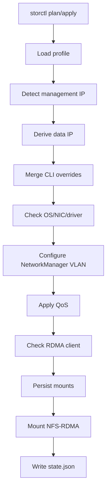

# storctl

`storctl` joins a lab host to NFS-RDMA storage.

It configures a storage NIC, NetworkManager VLAN, routing rule, CX7/1823 QoS,
NFS-RDMA mounts, mount persistence, and a small state file for later checks. It
is designed to be copied to one host and run directly, or called by Ansible for
batch onboarding.

## Quick Start

Explicit single-host mode:

```bash
storctl apply \
  --nic enp194s0f1np1 \
  --nic-type auto \
  --vlan-id 172 \
  --data-ip 172.27.2.146/18 \
  --gateway 172.27.0.1 \
  --route-table 5000 \
  --artifact-dir /root/storage_pkgs \
  --mount 172.27.1.1:/Share:/mnt/share \
  --mount 172.27.1.1:/Weight:/mnt/weight
```

Profile-driven mode:

```bash
storctl plan --profile c4 --nic enp23s0f1 --mgmt-ip 80.5.17.113
storctl apply --profile c4 --nic enp23s0f1 --mgmt-ip 80.5.17.113
```

Check the current host:

```bash
storctl check
```

## Workflow



`plan` stops after rendering the final configuration. It never changes the
host. `apply` runs the full workflow.

## Profiles

Profiles reduce per-host arguments. `storctl` looks for profiles in this order:

1. `--profile-file /path/to/storctl-profiles.json`
2. `./storctl-profiles.json`
3. `/etc/storctl/profiles.json`

Example:

```json
{
  "profiles": {
    "c4": {
      "vlan_id": 172,
      "gateway": "172.27.0.1",
      "prefix": 18,
      "route_table": 5000,
      "mtu": 5500,
      "artifact_dir": "/root/storage_pkgs",
      "third_octet_map": {
        "17": 4
      },
      "mounts": [
        {"server": "172.27.1.1", "export": "/Share", "mount_point": "/mnt/share"},
        {"server": "172.27.1.1", "export": "/Weight", "mount_point": "/mnt/weight"}
      ]
    }
  }
}
```

Data IP derivation uses the management IP:

```text
mgmt-ip 80.5.17.113
third_octet_map["17"] = 4
prefix = 18
result = 172.27.4.113/18
```

CLI arguments always win over profile values. For example, `--data-ip` skips
data IP derivation, and repeated `--mount` flags replace profile mounts.

## Batch Usage

Recommended Ansible shape:

```bash
ansible all -m copy -a "src=storctl-linux-arm64 dest=/usr/local/bin/storctl mode=0755"
ansible all -m copy -a "src=storctl-profiles.json dest=/etc/storctl/profiles.json"
ansible all -m shell -a "storctl plan --profile c4 --nic {{ storage_nic }} --mgmt-ip {{ ansible_host }}"
ansible all -m shell -a "storctl apply --profile c4 --nic {{ storage_nic }} --mgmt-ip {{ ansible_host }}"
```

For mixed clusters, create one profile per cluster and pass the profile name
from inventory:

```bash
ansible all -m shell -a "storctl apply --profile {{ storage_profile }} --nic {{ storage_nic }} --mgmt-ip {{ ansible_host }}"
```

## Build

```bash
go test ./...
go build ./cmd/storctl
GOOS=linux GOARCH=arm64 go build -o storctl-linux-arm64 ./cmd/storctl
```

## Driver Artifacts

Artifacts are read from `--artifact-dir`; `storctl` does not fetch public
packages by itself.

- CX7 supports `doca-host*.rpm`, then installs `doca-ofed` through the host's
  configured `dnf` repos.
- CX7 also supports legacy `MLNX_OFED_LINUX-*.tgz` and `IB_NIC-*.tgz`.
- 1823 supports `nic_1823.tar.gz` or `hinic*.tar.gz`.
- Firmware upgrade is disabled unless `--upgrade-firmware` is set.

For DOCA-Host:

```bash
wget https://www.mellanox.com/downloads/DOCA/DOCA_v3.3.0/host/doca-host-3.3.0-088000_26.01_openeuler2403.aarch64.rpm
mkdir -p /root/storage_pkgs
cp doca-host-3.3.0-088000_26.01_openeuler2403.aarch64.rpm /root/storage_pkgs/
```

## Troubleshooting

`rdma link` is empty:

- The host has no available RDMA device, so NFS-RDMA cannot work yet.
- Check drivers and modules:
  ```bash
  rdma link
  lsmod | grep -iE 'rdma|roce|ib_|uverbs|xprtrdma|hinic|mlx5'
  modprobe xprtrdma
  ```

Mount is TCP instead of RDMA:

- `storctl` remounts target paths when it finds `proto=tcp`.
- Verify:
  ```bash
  findmnt --mountpoint /mnt/share -o TARGET,FSTYPE,SOURCE,OPTIONS
  nfsstat -m
  ```

systemd automount fails:

- `storctl` falls back to direct `mount -t nfs`.
- Inspect unit logs:
  ```bash
  systemctl status mnt-share.automount --no-pager
  journalctl -u mnt-share.automount -xe
  ```

1823 ECN sysfs is missing:

- Some 1823 driver versions do not expose `/sys/class/net/<nic>/ecn/cc_algo`.
- `storctl` treats that as optional and still applies `hinicadm3 qos`.

## Notes

- `storctl` does not implement DTFS, `cid`, `dn`, or zone generation.
- State is written to `/var/lib/storctl/state.json`.
- With systemd, mounts use `.mount/.automount` units. Without systemd, mounts
  are persisted in `/etc/fstab`.
