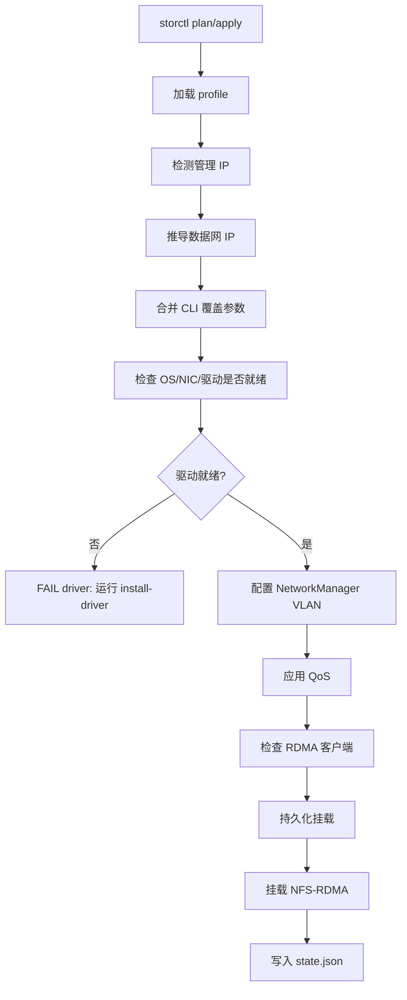

# storctl

[English documentation](README.en.md)

`storctl` 用于把实验室机器接入 NFS-RDMA 存储。

它会配置存储网卡、NetworkManager VLAN、策略路由、CX7/1823 QoS、NFS-RDMA 挂载、挂载持久化，并写入一个状态文件供后续检查。它既可以单机直接运行，也可以被 Ansible 调用做批量接入。

默认假设实验室离线或弱联网：`apply` 只检查驱动是否就绪，不会自动联网安装驱动。驱动包由你通过 Ansible/scp 预分发到 `--artifact-dir`，再显式执行 `storctl install-driver`。

## 快速开始

单机显式参数模式：

```bash
storctl apply \
  --nic enp194s0f1np1 \
  --nic-type auto \
  --vlan-id 172 \
  --data-ip 172.27.2.146/18 \
  --gateway 172.27.0.1 \
  --route-table 5000 \
  --artifact-dir /root/storage_pkgs \
  --mount 172.27.1.1:/Share:/mnt/share \
  --mount 172.27.1.1:/Weight:/mnt/weight
```

Profile 模式：

```bash
storctl plan --profile c4 --nic enp23s0f1 --mgmt-ip 80.5.17.113
storctl apply --profile c4 --nic enp23s0f1 --mgmt-ip 80.5.17.113
```

检查当前机器状态：

```bash
storctl check
```

离线安装驱动：

```bash
storctl install-driver --nic-type cx7 --artifact-dir /root/storage_pkgs
storctl install-driver --nic-type 1823 --artifact-dir /root/storage_pkgs
```

## 工作流



`plan` 只输出最终配置，不修改机器。`apply` 执行完整接入流程。

## Profiles

Profile 用来减少每台机器需要传入的参数。`storctl` 按下面顺序查找 profile 文件：

1. `--profile-file /path/to/storctl-profiles.json`
2. `./storctl-profiles.json`
3. `/etc/storctl/profiles.json`

示例：

```json
{
  "profiles": {
    "c4": {
      "vlan_id": 172,
      "gateway": "172.27.0.1",
      "prefix": 18,
      "route_table": 5000,
      "mtu": 5500,
      "artifact_dir": "/root/storage_pkgs",
      "third_octet_map": {
        "17": 4
      },
      "mounts": [
        {"server": "172.27.1.1", "export": "/Share", "mount_point": "/mnt/share"},
        {"server": "172.27.1.1", "export": "/Weight", "mount_point": "/mnt/weight"}
      ]
    }
  }
}
```

数据网 IP 根据管理 IP 推导：

```text
mgmt-ip 80.5.17.113
third_octet_map["17"] = 4
prefix = 18
result = 172.27.4.113/18
```

CLI 参数优先级最高。比如显式传 `--data-ip` 会跳过 IP 推导，重复传 `--mount` 会覆盖 profile 里的挂载配置。

## 批量使用

推荐 Ansible 形态：

```bash
ansible all -m copy -a "src=storctl-linux-arm64 dest=/usr/local/bin/storctl mode=0755"
ansible all -m copy -a "src=storage_pkgs/ dest=/root/storage_pkgs/"
ansible all -m copy -a "src=storctl-profiles.json dest=/etc/storctl/profiles.json"
ansible all -m shell -a "storctl install-driver --nic-type {{ nic_type }} --artifact-dir /root/storage_pkgs"
ansible all -m shell -a "storctl plan --profile c4 --nic {{ storage_nic }} --mgmt-ip {{ ansible_host }}"
ansible all -m shell -a "storctl apply --profile c4 --nic {{ storage_nic }} --mgmt-ip {{ ansible_host }}"
```

如果有多个集群，每个集群维护一个 profile，并在 inventory 中传入 profile 名称：

```bash
ansible all -m shell -a "storctl apply --profile {{ storage_profile }} --nic {{ storage_nic }} --mgmt-ip {{ ansible_host }}"
```

## 构建

```bash
go test ./...
go build ./cmd/storctl
GOOS=linux GOARCH=arm64 go build -o storctl-linux-arm64 ./cmd/storctl
```

## 离线驱动包

驱动包从 `--artifact-dir` 指定目录读取；`storctl apply` 不安装驱动，也不会访问公网。驱动安装必须显式执行 `storctl install-driver`。

目录里必须放一个 manifest：

```text
/root/storage_pkgs/
  storctl-artifacts.json
  MLNX_OFED_LINUX-5.8-1.1.2.1-openeuler22.03-aarch64.tgz
  nic_1823-openeuler22.03-aarch64.tar.gz
```

`storctl-artifacts.json` 示例：

```json
{
  "artifacts": [
    {
      "os_id": "openEuler",
      "os_version_prefix": "22.03",
      "arch": "aarch64",
      "nic_type": "cx7",
      "file": "MLNX_OFED_LINUX-5.8-1.1.2.1-openeuler22.03-aarch64.tgz",
      "sha256": "replace-with-sha256",
      "requires_repo": false
    },
    {
      "os_id": "openEuler",
      "os_version_prefix": "22.03",
      "arch": "aarch64",
      "nic_type": "1823",
      "file": "nic_1823-openeuler22.03-aarch64.tar.gz",
      "sha256": "replace-with-sha256",
      "requires_repo": false
    }
  ]
}
```

仓库里也提供了 [storctl-artifacts.example.json](storctl-artifacts.example.json) 作为模板。

生成校验值：

```bash
sha256sum /root/storage_pkgs/*.tgz /root/storage_pkgs/*.tar.gz
```

- CX7 优先使用真离线的 `MLNX_OFED_LINUX-*.tgz` 或 `IB_NIC-*.tgz`。
- 1823 支持 `nic_1823.tar.gz` 或 `hinic*.tar.gz`。
- 默认不升级固件，除非显式传 `--upgrade-firmware`。
- `doca-host*.rpm` 属于 repo installer。只有 manifest 标记 `"requires_repo": true`，且命令显式传 `--allow-repo` 时才允许：

```bash
storctl install-driver --nic-type cx7 --artifact-dir /root/storage_pkgs --allow-repo
```

推荐把 OS/驱动对应关系放到团队 wiki，人看 wiki，工具看 manifest：

| OS | Arch | CX7 artifact | 1823 artifact | 备注 |
| --- | --- | --- | --- | --- |
| openEuler 22.03 | aarch64 | `MLNX_OFED_LINUX-*.tgz` | `nic_1823*.tar.gz` | 当前主力路径 |
| openEuler 23.x | aarch64 | 待验证 | 待验证 | manifest 中单独配置 |
| openEuler 24.03 | aarch64 | DOCA/MLNX 对应包 | 待验证 | 尽量选择真离线包 |

如果必须使用 DOCA Host，请先在实验室内准备可用的 dnf repo。`storctl` 不负责维护跨实验室仓库。

## TCP 降级

```bash
storctl apply ... --allow-tcp-fallback
```

默认目标是 NFS-RDMA。RDMA 不通时，`apply` 会失败并保留已完成配置，不会静默改成 TCP。

只有显式传 `--allow-tcp-fallback` 时，工具才会挂 TCP NFS、持久化 TCP 参数，并在 `/var/lib/storctl/state.json` 标记 `degraded: true`。之后 `storctl check` 会输出 `WARN degraded tcp-fallback`。这个模式适合临时保业务，不适合当作性能达标状态。

## 排障

`rdma link` 为空：

- 当前机器没有可用 RDMA 设备，NFS-RDMA 还不能工作。
- 检查驱动和模块：
  ```bash
  rdma link
  lsmod | grep -iE 'rdma|roce|ib_|uverbs|xprtrdma|hinic|mlx5'
  modprobe xprtrdma
  ```

挂载是 TCP，不是 RDMA：

- 默认情况下，`storctl` 发现 `proto=tcp` 时会尝试重新挂成 RDMA。
- 如果你接受临时降级，显式传 `--allow-tcp-fallback`。
- 验证命令：
  ```bash
  findmnt --mountpoint /mnt/share -o TARGET,FSTYPE,SOURCE,OPTIONS
  nfsstat -m
  ```

systemd automount 失败：

- `storctl` 会 fallback 到直接 `mount -t nfs`。
- 查看 unit 日志：
  ```bash
  systemctl status mnt-share.automount --no-pager
  journalctl -u mnt-share.automount -xe
  ```

1823 缺少 ECN sysfs：

- 部分 1823 驱动版本没有 `/sys/class/net/<nic>/ecn/cc_algo`。
- `storctl` 会把它当作可选项跳过，并继续执行 `hinicadm3 qos`。

## 说明

- `storctl` 不实现 DTFS、`cid`、`dn` 或 zone 生成。
- 状态文件写入 `/var/lib/storctl/state.json`。
- 有 systemd 时使用 `.mount/.automount` 持久化挂载；没有 systemd 时写入 `/etc/fstab`。
